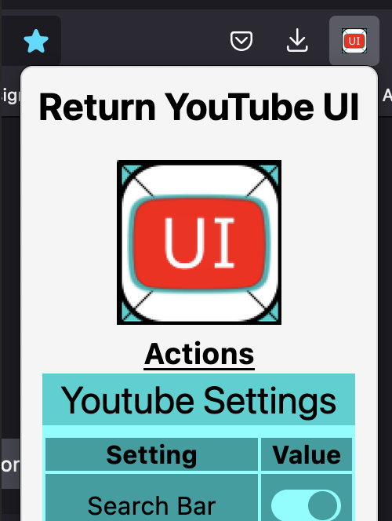

# Return YouTube UI

An extension making YouTube look like it did before everything was given rounded corners.

#### Supported Browsers
* Firefox
  * Main priority
  * Every version will be compatible with the latest version of Firefox at publish time
* Chromium-based browsers
  * Lesser priority
  * Most functionality tested with Brave

Due to currently divulging implementation of V3 manifests between Firefox and Google, to work with Chromium-based browsers instead of Firefox you must switch the commented lines in manifest.json.
<br>
_manifest.json_
````json
"background": {
  "scripts": ["background/background.js"]
//    "service_worker": "background/background.js"
},
 ````

_Major releases are published to the Firefox Add-Ons page as an extension ([addons.mozilla.org/...](https://addons.mozilla.org/en-US/firefox/addon/return-youtube-ui/)) and will continue to receive new updates. To install another version or your own fork, visit [firefox-source-docs.mozilla.org/...](https://firefox-source-docs.mozilla.org/devtools-user/about_colon_debugging/index.html) for instructions (or just enter [about:debugging#/runtime/this-firefox](https://addons.mozilla.org/en-US/firefox/addon/return-youtube-ui/)) into your url-bar._

<div style="text-align: center;">
    
    
</div>

---

## Settings & Customization Flags

Settings control is being migrated to the extension popup page. With the latest versions, some settings have been moved while others are still only available to be set as static variables before installation. Those values can be adjusted by setting flags at the very top of "_returnYouTubeUI.js_".

#### Items that are the core principles of return are on by default
| Setting                            | Default & Location     | Description                                                                                                                     |
|------------------------------------|------------------------|---------------------------------------------------------------------------------------------------------------------------------|
| Videos Per Row                     | 4 (popup)              | Sets the number of video columns on the homepage and channel "videos" pages to a user provided value (min = 1).                 |
| Thumbnails                         | true (popup)           | Hardens corners for thumbnails mini-players everywhere.                                                                         |
| Subscribe Color                    | true (popup)           | Brings back the red to the subscribe color.                                                                                     |
| Subscribe Shape                    | true (popup)           | Brings back the shape subscribe color.                                                                                          |
| Search Bar                         | true (popup)           | Reverts the radius of search bar back to how it was before.                                                                     |
| Menus                              | true (popup)           | Un-rounds borders in all (found) menus.                                                                                         |
| Action Buttons                     | true (popup)           | Removes borders on action bar buttons.                                                                                          |
| SAVE_VISIBLE_BEFORE_CLIP           | tmp. removed           | Places save action before the clip action, not yet working in all environments.                                                 |
| Actions Space %                    | +5 (popup)             | +5 for adding one more action, for example, showing share, clip, and save instead of just share and clip.                       |
| SHOW_VIDEO_LENGTH_IN_NOTIFICATIONS | Planned (false/extras) | Shows video length in notifications like it does in thumbnail views.                                                            |
| SHOW_CHANGES_BACKGROUNDS           | Planned (false/extras) | Changes background color of all changed elements for demonstration.                                                             |

<hr/>

## How You Can Help

If you try it out, please let me know if the changes feels natural on your device/aspect ratio.

**In addition, any screenshots or saved pages from before the UI change would be appreciated if you have them. Finding differences that could be applied without creating the old view from scratch would simplify the process.**

Feel free to message me with any questions or suggestions! :)
